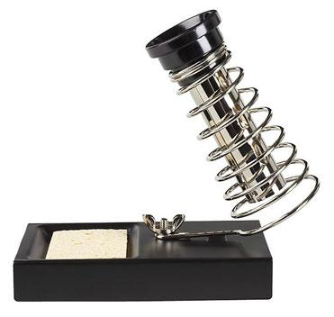

# **How To Solder: A Beginner’s Guide**

Learning how to solder w/ proper soldering techniques is a fundamental skill every maker should master. In this tutorial, we outline the basics of soldering irons, soldering stations, types of solder, desoldering and safety tips. Whether you’re building a robot or working with Arduino, knowing how to solder will come in handy.

**FREE EBOOK (PDF)** – Learn How To Solder (17 Page Ebook)
# **What Is Soldering?**
If you were to take apart any electronic device that contains a circuit board, you’ll see the components are attached using soldering techniques. Soldering is the process of joining two or more electronic parts together by melting solder around the connection. Solder is a metal alloy and when it cools it creates a strong electrical bond between the parts. Even though soldering can create a permanent connection, it can also be reversed using a desoldering tool as described below.

# **Soldering Tools**
The good thing about learning how to solder is the fact that you don’t need a lot to get started. Below we’ll outline the basic tools and materials you will need for most of your soldering projects.
## **Soldering Iron**
A soldering iron is a hand tool that plugs into a standard 120v AC outlet and heats up in order to melt solder around electrical connections. This is one of the most important tools used in soldering and it can come in a few variations such as pen or gun form. For beginners, it’s recommended that you use the pen style soldering iron in the 15W to 30W range. Most soldering irons have interchangeable tips that can be used for different soldering applications. Be very cautious when using any type of soldering iron because it can heat up to 896′ F which is extremely hot.

## **Soldering Station**
A soldering station is a more advanced version of the basic standalone soldering pen. If you are going to be doing a lot of soldering, these are great to have as they offer more flexibility and control. The main benefit of a soldering station is the ability to precisely adjust the temperature of the soldering iron which is great for a range of projects. These stations can also create a safer workspace as some include advanced temperature sensors, alert settings and even password protection for safety.

## **Soldering Iron Tips**
At the end of most soldering irons is an interchangeable part known as a soldering tip. There are many variations of this tip and they come in a wide variety of shapes and sizes. Each tip is used for a specific purpose and offers a distinct advantage over another. The most common tips you will use in electronics projects are the [conical tip](https://www.sparkfun.com/products/10721) and the [chisel tip](https://www.sparkfun.com/products/10720).

**Conical Tip** – Used in precision electronics soldering because of the fine tip. Because of its pointed end, it’s able to deliver heat to smaller areas without affecting its surroundings.

**Chisel Tip** – This tip is well-suited to soldering wires or other larger components because of its broad flat tip.

*Image Credit – Sparkfun.com*
## **Brass or Conventional Sponge**
Using a sponge will help to keep the soldering iron tip clean by removing the oxidation that forms. Tips with oxidation will tend to turn black and not accept solder as it did when it was new. You could use a conventional wet sponge but this tends to shorten the lifespan of the tip due to expansion and contraction. Also, a wet sponge will drop the temperature of the tip temporarily when wiped. A better alternative is to use a [brass sponge](https://www.adafruit.com/product/1172) as shown on the left.

## **Soldering Iron Stand**
A [soldering iron stand](https://www.adafruit.com/product/150) is very basic but very useful and handy to have. This stand helps prevent the hot iron tip from coming in contact with flammable materials or causing accidental injury to your hand. Most soldering stations come with this built in and also include a sponge or brass sponge for cleaning the tip.

## **Solder**
Solder is a metal alloy material that is melted to create a permanent bond between electrical parts. It comes in both lead and lead-free variations with diameters of .032″ and .062″ being the most common. Inside the solder core is a material known as flux which helps improve electrical contact and its mechanical strength.

For electronics soldering, the most commonly used type is [lead-free rosin core solder](http://www.jameco.com/z/209074-R-1-Pound-Lead-Free-Solder-Roll-99-3Sn-0-7Cu-0-031-Inch-Diameter_209075.html). This type of solder is usually made up of a Tin/Copper alloy. You can also use leaded 60/40 (60% tin, 40% lead) rosin core solder but it’s becoming less popular due to health concerns. If you do use lead solder, make sure you have proper ventilation and that you wash your hands after use.

When buying solder, make sure NOT to use acid core solder as this will damage your circuits and components. Acid core solder is sold at home improvement stores and is mainly used for plumbing and metal working.

As mentioned earlier, solder does come in a few different diameters. The thicker diameter solder (.062″) is good for soldering larger joints more quickly but it can make soldering smaller joints difficult. For this reason, it’s always a good idea to have both sizes on hand for your different projects.
## **Helping Hand (Third Hand)**
A [helping hand](https://www.sparkfun.com/products/9317) is a device that has 2 or more alligator clips and sometimes a magnifying glass/light attached. This clips will assist you by holding the items you are trying to solder while you use the soldering iron and solder. A very helpful tool to have in your makerspace.

# **Soldering Safety**
Now that you know what tools and materials are required, it’s time to briefly discuss ways of staying safe while soldering.

Soldering irons can reach temperatures of 800′ F so it’s very important to know where your iron is at all times. We always recommend you use a soldering iron stand to help prevent accidental burns or damage.

Make sure you are soldering in a well ventilated area. When solder is heated, there are fumes released that are harmful to your eyes and lungs. It’s recommended to use a [fume extractor](https://www.walmart.com/ip/1000l-Adjustable-Solder-Smoke-Absorber-Remover-Fume-Extractor-Carbon-Filter-Quiet-Fan-for-ESD-Soldering-Station/184014434) which is a fan with a charcoal filter that absorbs the harmful solder smoke. You can visit sites like [Integrated Air Systems](https://www.integratedair.co.uk/) for air filtration systems.

It’s always a good idea to wear protective eye wear in case of accidental splashes of hot solder. Lastly, make sure to wash your hands when soldering , especially if using lead solder.
# **Tinning The Tip**
Before you can start soldering, you need to prep your soldering iron by tinning the tip with solder. This process will help improve the heat transfer from the iron to the item you’re soldering. Tinning will also help to protect the tip and reduce wear.

**Step 1:** Begin by making sure the tip is attached to the iron and screwed tightly in place.

**Step 2:** Turn on your soldering iron and let it heat up. If you have a soldering station with an adjustable temp control, set it to 400′ C/ 752′ F.

**Step 3:** Wipe the tip of the soldering iron on a damp wet sponge to clean it. Wait a few seconds to let the tip heat up again before proceeding to step 4.

**Step 4:** Hold the soldering iron in one hand and solder in the other. Touch the solder to the tip of the iron and make sure the solder flows evenly around the tip.

You should tin the tip of your iron before and after each soldering session to extend its life. Eventually, every tip will wear out and will need replacing when it becomes rough or pitted.
# **How To Solder**
To better explain how to solder, we’re going to demonstrate it with a real world application. In this example, we’re going to solder an LED to a circuit board.

**Step 1: Mount The Component** – Begin by inserting the leads of the LED into the holes of the circuit board. Flip the board over and bend the leads outward at a 45′ angle. This will help the component make a better connection with the copper pad and prevent it from falling out while soldering.

**Step 2: Heat The Joint** – Turn your soldering iron on and if it has an adjustable heat control, set it to 400’C. At this point, touch the tip of the iron to the copper pad and the resistor lead at the same time. You need to hold the soldering iron in place for 3-4 seconds in order to heat the pad and the lead.

**Step 3: Apply Solder To Joint** – Continue holding the soldering iron on the copper pad and the lead and touch your solder to the joint. **IMPORTANT** – Don’t touch the solder directly to the tip of the iron. You want the joint to be hot enough to melt the solder when it’s touched. If the joint is too cold, it will form a bad connection.

**Step 4: Snip The Leads** – Remove the soldering iron and let the solder cool down naturally. Don’t blow on the solder as this will cause a bad joint. Once cool, you can snip the extra wire from leads.

A proper solder joint is smooth, shiny and looks like a volcano or cone shape. You want just enough solder to cover the entire joint but not too much so it becomes a ball or spills to a nearby lead or joint.

# **How To Solder Wires**
Now it’s time to show you how to solder wires together. For this process, it’s recommended to use helping hands or other type of clamp device.

Begin by removing the insulation from the ends of both wires you are soldering together. If the wire is stranded, twist the strands together with your fingers.

Make sure your soldering iron is fully heated and touch the tip to the end of one of the wires. Hold it on the wire for 3-4 seconds.

Keep the iron in place and touch the solder to the wire until it’s fully coated. Repeat this process on the other wire.

Hold the two tinned wires on top of each other and touch the soldering iron to both wires. This process should melt the solder and coat both wires evenly.

Remove the soldering iron and wait a few seconds to let the soldered connection cool and harden. Use heat shrink to cover the connection.

# **Desoldering**
The good thing about using solder is the fact that it can be removed easily in a technique known as desoldering. This comes in handy if you need to remove a component or make a correction to your electronic circuit.

To desolder a joint, you will need solder wick which is also known as [desoldering braid](https://www.digikey.com/).

**Step 1** – Place a piece of the desoldering braid on top of the joint/solder you want removed.

**Step 2** – Heat your soldering iron and touch the tip to the top of the braid. This will heat the solder below which will then be absorbed into the desoldering braid. You can now remove the braid to see the solder has been extracted and removed. Be careful touching the braid when you are heating it because it will get hot.

**Optional** – If you have a lot of solder you want removed, you may want to use a device called a solder sucker. This is a handheld mechanical vacuum that sucks up hot solder with a press of a button.

To use, press the plunger down at the end of the solder sucker. Heat the joint with your soldering iron and place the tip of the solder sucker over the hot solder. Press the release button to suck up the liquid solder. In order to empty the solder sucker, press down on the plunger.

