# Basic Electronics
Start your journey in Electronics with a solid background. Explore the best beginner friendly tutorials that teach the basics.

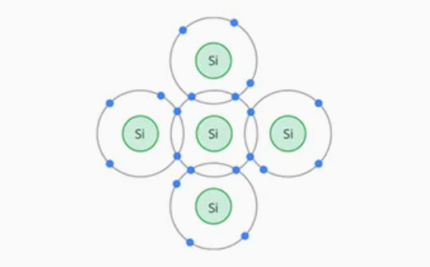
### Semiconductor Basics 
To understand how diodes, transistors, or any integrated circuit work, you must first study the
### PN Junction Diode
A piece of n-type semiconductor or p-type semiconductor is like a resistor, which is not…

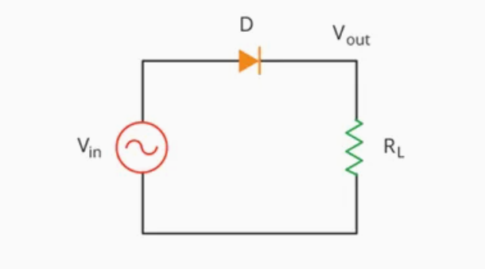
### The Half-Wave Rectifier
Most electronic systems, like TVs, audio systems, and computers, need a DC voltage to work…

### The Full-Wave Rectifier 
Although the half wave rectifier is used in some low power applications such as signal…

### The Full-Wave Bridge Rectifier 
Another, more popular full-wave rectifier design exists and is built around a four-diode bridge configuration…

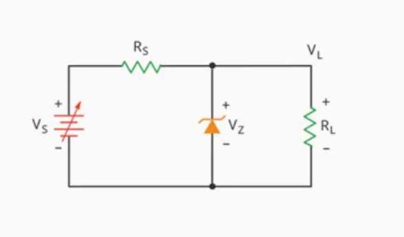
### The Zener Diode 
Ordinary silicon diodes block any current through them when they are reverse biased, and are…

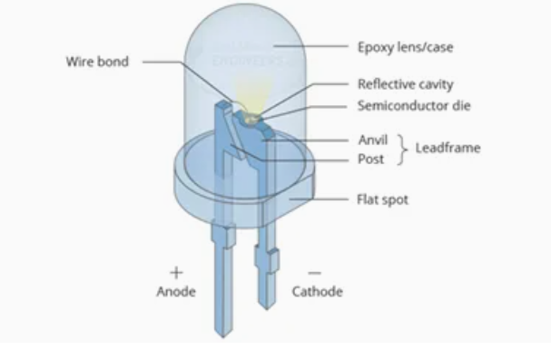
### Light Emitting Diode [ LED ]
LEDs are everywhere – in our phones, in our cars, and even in our homes…

New Tab with Semiconductor

# Semiconductor Basics
To understand how diodes, transistors, or any integrated circuit work, you must first study the semiconductor – a material that is neither a conductor or an insulator.

Before knowing the semiconductor, let’s understand what makes a material either a conductor or an insulator.
## Conductor
We all know that copper is a good conductor. The reason is obvious when we look at its atomic structure.

The nucleus of a copper atom has 29 protons (positive charge). 29 electrons (negative charge) revolve around the nucleus. There are 2 electrons in the first orbit, 8 electrons in the second, 18 in the third and 1 electron in the outer orbit.

In electronics, all that matters is the outer orbit, as it determines the conductivity of the atom. It is also called valence orbit.
### Net Charge
To find the net charge of an atom, we define the core of an atom as the nucleus and all the inner orbitals.

The core of a copper atom has a nucleus (+29 protons) and the first three orbits (-28 electrons). That’s why the core of a copper atom has a net charge of +1 (+29 of protons -28 of electrons)

Following figure illustrates the core and the valence orbit of a copper atom.

### Free Electrons
Because the core has a net charge of only +1, the attraction between the core and the valence electron is very weak. Even a nominal voltage can easily dislodge this electron from a copper atom and cause it to flow through the material. This is why the valence electron is often called a Free electron. And the flow of these free electrons is called Current.

Number of free electrons in copper, as in other metals, is what makes it a good conductor of electricity.
## Insulators
Neon is an example of a best insulator. Let’s look at its atomic structure.

A neon atom has 10 protons and 10 electrons. The first orbit contains two electrons and the remaining eight electrons are in the valence orbit.

The core of a neon atom has a net charge of +8 because it contains 10 protons in the nucleus and 2 electrons in the first orbit. Following figure shows the core diagram of a neon atom.

Because the core has a net charge of +8, the inward pull felt by the valence electrons is very large. Therefore, due to lack of free electrons, insulators do not conduct.

If a high enough voltage is applied to an insulator, the force is so great that the valence electrons are literally torn from their atoms. This will cause conduction. In the air you will see it as an arc or flash. In solid materials the heat generated will char the material.
## Semiconductors
A semiconductor is an element that is neither a good conductor nor a good insulator. As you might expect, the best semiconductors have four valence electrons.

Silicon is an example of a semiconductor. Let’s look at its atomic structure.

A silicon atom has 14 protons and 14 electrons. The first orbit contains two electrons and the second orbit contains eight electrons. The four remaining electrons are in the valence orbit.

The core of a silicon atom has a net charge of +4 because it contains 14 protons in the nucleus and 10 electrons in the first two orbits. Following figure shows the core diagram of a silicon atom.

The conductivity of the atom depends on the number of valence electrons. When an atom has only one valence electron, it is the best conductor. When an atom has eight valence electrons, the atom is a best insulator.

As you can see a silicon atom has four valence electrons due to which its electrical conductivity falls between that of a conductor and an insulator. This is what makes silicon a Semiconductor.
## Silicon Crystals
When silicon atoms combine to form a crystal, they arrange themselves in a systematic pattern. Each silicon atom shares its valence electrons with four neighboring atoms such that every atom has eight electrons in its valence orbit.

The following figure shows how a silicon atom shares electrons with four neighbors.

## Covalent Bonds
Due to sharing, valence electrons no longer belong to any one atom. These shared valence electrons are pulled by neighboring atoms with equal and opposite forces, causing them to form a bond. We call this type of chemical bond a Covalent bond.

The following figure shows the concept of covalent bonds where each straight line represents one shared electron.

This pulling in opposite directions is what holds the silicon atoms together and gives them solidity.
## The Holes
At room temperature, the thermal energy in the air causes the atoms in a silicon crystal to vibrate. These vibrations remove the electron from the valence orbit. This free electron starts moving randomly throughout the crystal.

The departure of the electron creates a vacancy in the valence orbit called a hole. This hole behaves like a positive charge because the loss of an electron produces a positive ion.

When a free electron enters the immediate vicinity of the hole, it is attracted towards the hole and falls into it. The process of merging a free electron and a hole is called Recombination.
## Flow of Free Electrons and Holes
Let’s connect a battery across a pure silicon crystal. Assume that thermal energy has produced a free electron and a hole.

The applied voltage forces free electrons to flow to the left and holes to the right. When free electrons reach the left end of the crystal, they enter the external wire and flow towards the positive battery terminal.

On the other hand, free electrons at the negative battery terminal flow to the right end of the crystal. They enter the crystal and recombine with holes that have reached the right end of the crystal.

In this way, a steady flow of free electrons and holes is established inside the semiconductor.

Free electrons and holes are often called Carriers because they carry a charge from one place to another.
## Doping a Semiconductor
In a pure silicon crystal, each silicon atom uses four valence electrons to bond with its neighboring atoms. This reduces the number of electrons available for conduction. Due to this it acts as an insulator.

To increase the number of holes and free electrons in a silicon crystal, and thus to increase its conductivity, it is necessary to dope the crystal.

Doping is the process of adding impurities to a pure silicon crystal to alter its electrical conductivity. And the impurity that is added is called a Dopant.

The more impurities are added, the greater the number of free electrons and holes, resulting in an increase in conductivity. Meaning, a lightly closed semiconductor has a high resistance, while a heavily doped semiconductor has a low resistance.

How is a silicon crystal doped?

First a pure silicon crystal is melted. This breaks covalent bonds and transforms silicon from a solid to a liquid. To increase the number of free electrons, pentavalent atoms are added to the molten silicon. And to increase the number of holes, trident atoms are added. Once it cools down, it turns into a solid crystal structure.
## n-Type Semiconductor
Silicon which is doped to increase the number of free electrons is called n-type semiconductor, where the n stands for negative.

To increase the number of free electrons, pentavalent impurities such as phosphorus, antimony or arsenic are added to silicon. Pentavalent atoms, as the name suggests, have five valence electrons. Following figure shows a phosphorus atom.

In n-type semiconductor, a pentavalent atom is in the center, surrounded by four silicon atoms. As we know, a pentavalent atom has five valence electrons. As before, neighboring silicon atoms share four electrons with a pentavalent atom. But this time, there is an extra electron left over (Since valence orbit can hold no more than eight electrons).

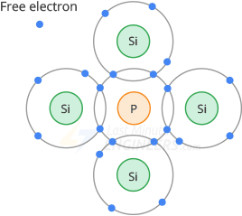

Because each pentavalent atom in a silicon crystal produces one free electron, the resulting doped material has a large number of free electrons.

In an n-type semiconductor, as free electrons are greater in number than holes, free electrons are called majority carriers and holes are called minority carriers.

Because the pentavalent impurities donate an extra electron to the silicon crystal, they are often referred to as donor impurities.
## p-Type Semiconductor
Silicon which is doped to increase the number of holes is called p-type semiconductor, where the p stands for positive.

To increase the number of holes, trialent impurities such as aluminum, boron, or gallium are added to silicon. Trivalent atoms, as the name suggests, have three valence electrons. Following figure shows a boron atom.

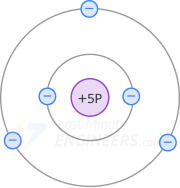

In p-type semiconductor, a trivalent atom is in the center, surrounded by four silicon atoms. Since the trivalent atom originally had only three valence electrons and each neighbor shares one electron, only seven electrons are in the valence orbit. This means that a hole exists in the valence orbit of each trivalent atom.

Because each trivalent atom in a silicon crystal produces one hole, the resulting doped material has a large number of holes.

In an p-type semiconductor, as holes are greater in number than free electrons, holes are called majority carriers and free electrons are called minority carriers.

A trivalent atom is also called an acceptor atom, because each hole it contributes, can accept a free electron during recombination.
## Going Further
In the next tutorial, we will see how a single silicon crystal is doped with p-type material on one side and n-type on the other side to form a PN Junction, which can be used to make a diode.

# PN Junction Diode
A piece of n-type semiconductor or p-type semiconductor is like a resistor, which is not so useful. But when a manufacturer does a single silicon crystal with p-type material on one side and n-type on the other side, something new comes into existence – the PN junction.

PN junctions are elementary building blocks of semiconductor devices such as diodes, transistors, solar cells, LEDs, and integrated circuits. Understanding this enables you to understand all these devices.
## The PN Junction
As we know that p-type semiconductor has trivalent atoms and each of them produces one hole, we can visualize it as shown in the figure. Each circled minus sign is the trivalent atom and each plus sign is the hole in its valence orbit.

We also know that n-type semiconductor has pentavalent atoms and each of them produces one free electron, we can visualize it as shown in the figure. Each circled plus sign is the pentavalent atom and each minus sign is the free electron it contributes.

A manufacturer can produce a single silicon crystal with p-type material on one side and n-type on the other side, as shown in the figure. The border between p-type and n-type is called the PN junction.

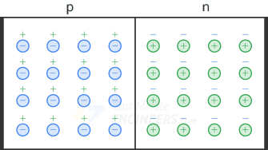

A PN crystal is commonly known as a junction diode. The word diode is a contraction of two electrodes, where di stands for two.

There are three possible biasing conditions for the PN Junction:

1. Equilibrium or Zero Bias – No external voltage is applied to the PN junction.
1. Reverse Bias – The positive source terminal is connected to the n-type, and the negative source terminal is connected to the p-type.
1. Forward Bias – The negative source terminal is connected to the n-type, and the positive source terminal is connected to the p-type.

Let’s look at them one by one.
## Equilibrium (zero bias)
In a PN junction, without an external applied voltage, an equilibrium condition is reached. Let’s see how.
### The Depletion Region
An N-type semiconductor has a larger number of free electrons than a P-type semiconductor. Due to this high concentration of electrons on the N-side, they repel each other.

Due to repulsion, free electrons spread (diffuse) in all directions. Some of them cross the junction. When a free electron enters the p region, it is attracted to the positive hole and recombines with it. When this happens, the hole disappears and the free electron becomes a valence electron.

When the free electron falls into a hole on the P-side, the P-side atom gains an extra electron. The atom which gains an extra electron has more electrons than protons, due to which it becomes a negative ion.

Similarly, each free electron that leaves the N-side atom creates a hole in the N-side atom. The atom that loses an electron has more protons than electrons, due to which it becomes a positive ion.

So each time an electron crosses the junction and recombines with a hole, it creates a pair of ions. Following figure shows these ions on each side of the junction.

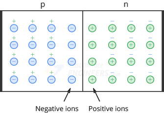

Each pair of positive and negative ions at the junction is called a dipole. The creation of a dipole means that one free electron from the n-side and one hole from the p-side are taken out of circulation. As the number of dipoles builds up, the region near the junction is depleted of majority charge carriers. Therefore we call this charge-empty region The depletion region.

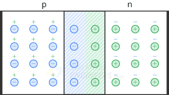
### Barrier Potential
Each dipole has an electric field between positive and negative ions. Whenever a free electron tries to enter the depletion region, this electric field pushes it back into the n region.

The strength of the electric field increases with each electron-hole recombination inside the depletion region. Therefore the electric field eventually stops the diffusion of electrons across the junction and equilibrium is reached.

The electric field between the ions is equivalent to a difference of potential called the barrier potential. At room temperature, the barrier potential equals approximately 0.3 V for germanium diodes and 0.7 V for silicon diodes.
## Forward Bias
In forward bias, the p-type is connected with the positive source terminal and the n-type is connected with the negative source terminal. Following figure shows a forward bias diode.

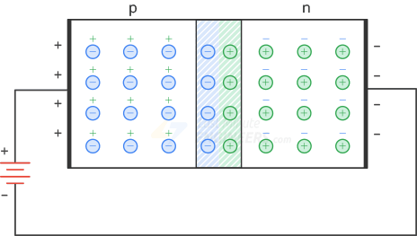

With a battery connected this way, the holes in the p region and the free electrons in the n region are pushed toward the junction. If the battery voltage is less than the barrier potential (0.7V), the free electrons do not have enough energy to get through the depletion layer. When they enter the depletion layer, the ions will push them back into the n region. Because of this, there is no current through the diode.

When the battery voltage is greater than the barrier potential (0.7V), the free electrons have enough energy to pass through the depletion layer and recombine with the holes. In this way they begin to neutralize the depletion region, reducing its width.

When a free electron is recombined with a hole, it becomes a valence electron. As a valence electron, it continues to travel to the left, passing from one hole to the next until it reaches the left end of the diode. When it leaves the left end of the diode, a new hole appears and the process starts again. Since there are billions of electrons traveling at the same time, we get a continuous current through the diode.

## Reverse Bias
Connecting the p-type to the negative terminal of the battery and the n-type to the positive terminal corresponds to reverse bias. Following figure shows a reverse bias diode.

The negative battery terminal attracts holes, and the positive battery terminal attracts free electrons. Because of this, holes and free electrons flow away from the junction leaving the positive and negative ions behind. Therefore, the depletion region gets wider.

The width of the depletion region is proportional to the reverse voltage. As the reverse voltage increases, the depletion region gets wider. The depletion region stops growing when its potential difference is equal to the applied reverse voltage. When this happens, electrons and holes stop moving away from the junction.
## Reverse Current
The reverse current in a diode consists of a minority-carrier current and a surface-leakage current. This reverse current is so small that you cannot even notice it and it is considered almost zero.
### Reverse Saturation Current
As we know, thermal energy continuously creates pairs of free electrons and holes. Suppose thermal energy has created a free electron and hole inside the depletion region.

The depletion region pushes the newly created free electron into the n region, forcing it to leave the right end of the diode. When it reaches the right end of the diode, it enters the external wire and flows towards the positive battery terminal.

On the other hand, the newly created hole is pushed into the p region. This extra hole on the p side allows one electron from the negative battery terminal to enter the left end of the diode and fall into a hole.

Since thermal energy continuously produces electron-hole pairs inside the depletion region, a small continuous current flows in the external circuit. Such reverse current caused by the thermally produced minority carriers is called the Saturation current. The name saturation means that increasing the reverse voltage will not increase the number of thermally produced minority carriers.
### Surface-Leakage Current
There exist another current in a reverse-biased diode. A small current flows on the surface of the crystal known as the Surface-leakage current.

The atoms on the top and bottom surface of the crystal have no neighbors. They have only six electrons in the valence orbit. This means that each surface atom has two holes. The following image shows these holes along the surface of the crystal.

Due to this, electrons travel through the surface holes from the negative battery terminal to the positive battery terminal. In this way, a small reverse current flows along the surface.
## Breakdown
There is a limit to how much reverse voltage a diode can withstand before getting destroyed. If you continue to increase the reverse voltage, the diode will eventually reach the breakdown voltage.

Once the breakdown voltage is reached, a large number of minority carriers are produced in the depletion region by Avalanche effect and the diode begins to conduct heavily in the reverse direction.
### Avalanche Effect
As we know there is a small minority-carrier current in a reverse-biased diode. When the reverse voltage increases, it forces minority carriers to move faster. These minority carriers moving at high speed collide with the atoms of the crystal and knock valence electrons loose, producing more free electrons. These new minority carriers join the existing minority carriers and collide with other atoms that knock off more electrons.

One free electron dislodges one valence electron, resulting in two free electrons. These two free electrons then dislodge two more electrons, resulting in four free electrons. In this way the number of electrons increases in Geometric progression: 1, 2, 4, 8, . . .

This constant collision with atoms generates a large number of minority carriers that produce a significant amount of reverse current in the diode. And this process continues until the reverse current becomes large enough to destroy the diode.
## Diode Schematic Symbol
Following figure shows the schematic symbol of a diode. The symbol looks like an arrow that points from the p side to the n side. The p side is called the anode and the n side the cathode.

## Diode I-V Characteristics
Following figure shows a basic diode circuit in which the diode is forward biased. A series resistor RS is usually used to limit the amount of forward current IF.

After connecting this circuit, if you measure the voltage and current of the diode for forward and reverse bias, and plot it, you will get a graph that looks like this:

This plot is called Current-Voltage (I-V) characteristics. This is the most important diode characteristic because it defines how much current flows through the diode for a given voltage.

A resistor is a linear device because its IV curve is a straight line. A diode, however, is different. It is a nonlinear device as its IV curve is not a straight line. This is due to the barrier potential.

Depending on the voltage applied across it, a diode will operate in one of three regions: Forward bias, Reverse bias, and Breakdown.
### Forward Bias Region
When the diode voltage is less than the barrier potential, a small current flows through the diode. When the diode voltage exceeds the barrier potential, the current flowing through the diode increases rapidly.

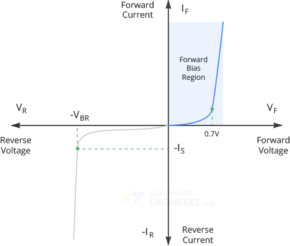

The voltage at which current starts to increase rapidly is called the forward voltage (VF) of the diode. It is also called cut-in voltage or knee voltage. Typically, a silicon diode has a VF around 0.7V and a germanium-based diode has around 0.3V.
### Reverse Bias Region
The reverse bias region exists between zero current and breakdown.

In this region, a small reverse current flows through the diode. This reverse current is caused by the thermally produced minority carriers. This reverse current is so small that you cannot even notice it and it is considered almost zero.

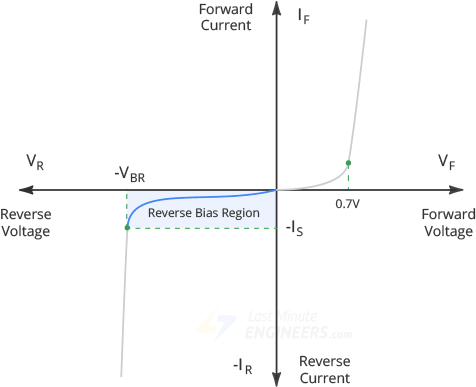
### Breakdown Region
If you continue increasing the reverse voltage, you will eventually reach the so-called breakdown voltage of the diode.

At this point, a process called Avalanche Breakdown occurs in the semiconductor depletion layer and the diode starts conducting heavily in the reverse direction, destroying the diode.

You can see from the graph that the breakdown has a very sharp knee, followed by an almost vertical increase in current.

# The Half-Wave Rectifier
Most electronic systems, like TVs, audio systems, and computers, need a DC voltage to work properly. Since the line voltage is alternating, we need to convert it to a relatively constant DC output voltage. The circuit that converts the alternating voltage (AC) into a continuous voltage (DC) is called a Rectifier.

As you know, a diode only conducts current in one direction from the anode to its cathode. This feature makes them ideal for Rectification.

The diodes are connected together to form various types of rectifier circuits such as “Half-wave”, “Full-wave” or “Bridge” rectifiers.

The simplest of all rectifiers is a Half-wave rectifier.
## The Half-Wave Rectifier
Following image shows a half-wave rectifier circuit.

When an alternating voltage is applied across a diode, the positive half-cycle of source voltage will forward-bias the diode. In this case, the diode will appear as a closed switch, and the positive half-cycle of source voltage will appear across the load resistor.

During the negative half-cycle, the diode is reverse biased. In this case, the diode will appear as an open switch, and no voltage appears across the load resistor.

In the half-wave rectifier, the diode conducts during the positive half-cycles and not during the negative half-cycles. Because of this, the half-wave rectifier clips off negative half-cycles. Such waveform is called a half-wave signal.

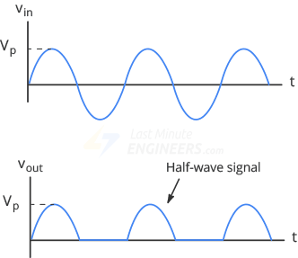

If the diode is reversed, it will become forward biased when the input voltage is negative. As a result, the output pulses will be negative.

This half-wave voltage produces a load current that flows in only one direction making the circuit unidirectional.
## DC Value of a Half-Wave Signal
The DC value of a half-wave signal is the same as the average value.

The average value of the signal over one cycle is calculated with the below formula:

This equation tells us that the DC value of a half-wave signal is about 31.8% of the peak value. For example, if the peak voltage of the half-wave signal is 10V, the DC voltage will be 3.18V

When you measure the half-wave signal with a DC voltmeter, the reading will equal the average DC value.
## A Second-order Approximation
In reality, we do not get a perfect half-wave voltage across the load resistor.

Because of the barrier potential, the diode does not turn on until the source voltage reaches about 0.7V. So, the output voltage is 0.7V lower than the peak source voltage.

For example, If the peak source voltage is only 10V, the load voltage will have a peak of only 9.3V.

Therefore the more accurate formula to calculate the DC value of a half-wave signal is:

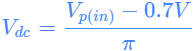
## Output Frequency
The variation of the rectified output waveform during positive and negative half cycles produces a waveform with a large amount of Ripple (the fluctuating part).

The resulting ripple has the same frequency as the input AC supply.

Therefore, we can write:

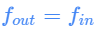
## Filtering the Output of a Rectifier
The output we get from a half-wave rectifier is a pulsating DC voltage that increases to a maximum and then decreases to zero.

We do not need this kind of DC voltage. What we need is a steady and constant DC voltage, free of any voltage variation or ripple, as we get from the battery.

To obtain such a voltage, we need to filter the half-wave signal. One way to do this is to connect a capacitor, known as a smoothing capacitor, across the load resistor as shown below.

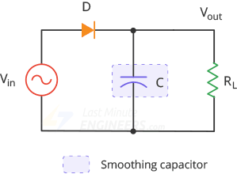

Initially, the capacitor is uncharged. During the first quarter-cycle, the diode is forward biased, so the capacitor starts charging. The charging continues until the input reaches its peak value. At this point, the capacitor voltage equals Vp.

After the input voltage reaches its peak, it begins to decrease. As soon as the input voltage is less than Vp, the voltage across the capacitor exceeds the input voltage which turns off the diode.

As the diode is off, the capacitor discharges through the load resistor and supplies the load current, until the next peak is arrived.

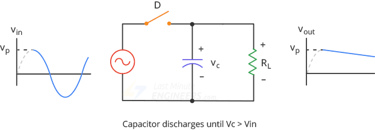

When the next peak arrives, the diode conducts briefly and recharges the capacitor to the peak value.

## Limitations
If the load resistor is small for a given capacitor value, a high current will flow through the load which discharges the capacitor more quickly (Because of the RC time constant) and results in increased ripples. As long as the RC time constant is much greater than the period, the capacitor remains almost fully charged, and we get a perfect DC output voltage. To have a greater RC time constant, we need a larger value capacitor. This is not practical because there are limits on both the cost and size of the capacitor.

Also there is no output during the negative half cycle hence half of the power is wasted which results in lower output amplitude.

Because of their major disadvantages the half-wave rectifiers are rarely used. It would be more practical to use a full wave rectifier as discussed in the next tutorial.
# The Full-Wave Rectifier
Although the Half wave rectifier is used in some low power applications such as signal and peak detector, it is seldom used in power rectification. The most used rectifier in the power rectification field is the full wave rectifier.

The full wave rectifier is more complex than the half wave rectifier, but it offers some significant benefits. It uses both half cycles of the sine wave resulting in a DC output voltage that is higher than that of the half wave rectifier. Another advantage is that the output has much less ripples, which makes it easier to produce a smooth output waveform.
## The Full-Wave Rectifier
To rectify both half cycles of a sine wave, the full-wave rectifier uses two diodes, one for each half of the cycle. It also uses a transformer with a center-tapped secondary winding.

The full-wave rectifier is like two back-to-back half-wave rectifiers. Following image shows a Full-wave rectifier circuit.

This circuit’s operation is easily understood one half-cycle at a time.

Consider the first half-cycle, when point A is positive with respect to C. At this time, D1 is forward biased and D2 is reverse biased. Therefore, only the top half of the transformer’s secondary winding carries current during this half-cycle. This produces a positive load voltage across the load resistor.

During the next half-cycle, the source voltage polarity reverses. Now, point B is positive with respect to C. This time, D2 is forward biased and D1 is reverse biased. As you can see, only the other half of the transformer’s secondary winding carry current. This also produces a positive load voltage across the load resistor as before.

As a result, the rectified load current flows during both half-cycles due to which we get Full-wave signal across the load.

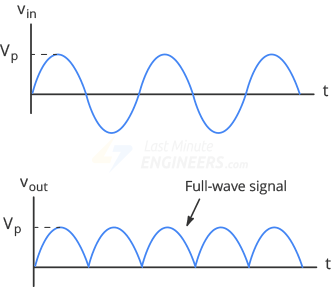
## DC Value of a Full-Wave Signal
Since the full-wave rectifier produces an output during both half-cycles, it has twice as many positive cycles as the half-wave signal. As a result the DC or average value is also twice as much:

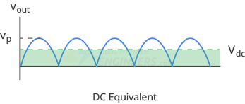

The average value of the signal over one cycle is calculated with the below formula:

This equation tells us that the DC value of a full-wave signal is about 63.6% of the peak value. For example, if the peak voltage of the full-wave signal is 10V, the DC voltage will be 6.36V

When you measure the full-wave signal with a DC voltmeter, the reading will equal the average DC value.
## A Second-order Approximation
In reality, we do not get a perfect full-wave voltage across the load resistor.

Because of the barrier potential, the diode does not turn on until the source voltage reaches about 0.7V. So, the output voltage is 0.7V lower than the ideal peak output voltage.
## Output Frequency
The full-wave rectifier inverts each negative half cycle, doubling the number of positive half cycles. Because of this, full-wave output has twice as many cycles as the input.

Therefore the frequency of the full-wave signal is double the input frequency.

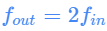

For example, if the line frequency is 60Hz, the output frequency will be 120Hz.
## Filtering the Output of a Rectifier
The output we get from a full-wave rectifier is a pulsating DC voltage that increases to a maximum and then decreases to zero.

We do not need this kind of DC voltage. What we need is a steady and constant DC voltage, free of any voltage variation or ripple, as we get from the battery.

To obtain such a voltage, we need to filter the full-wave signal. One way to do this is to connect a capacitor, known as a smoothing capacitor, across the load resistor as shown below.

Initially, the capacitor is uncharged. During the first quarter-cycle, the diode D1 is forward biased, so the capacitor starts charging. The charging continues until the input reaches its peak value. At this point, the capacitor voltage equals Vp.

After the input voltage reaches its peak, it begins to decrease. As soon as the input voltage is less than Vp, the voltage across the capacitor exceeds the input voltage which turns off the diode.

As the diode is off, the capacitor discharges through the load resistor and supplies the load current, until the next peak is arrived.

When the next peak arrives, the diode D2 conducts briefly and recharges the capacitor to the peak value.

## Disadvantages
One of the disadvantages of this center-tapped full-wave rectifier design is the necessity of a transformer with a center-tapped secondary winding. In high-power rectification, however, the cost and size of such transformers increase substantially. That’s why, the center-tap rectifier design is only seen in low-power applications.

Another disadvantage is that because of the center tap, only half of the secondary voltage is used for rectification.

To overcome these disadvantages four diodes are connected together in a “bridge” configuration to produce a Full wave Bridge rectifier as discussed in the next tutorial.
# The Full-Wave Bridge Rectifier
Another, more popular full-wave rectifier design exists and is built around a four-diode bridge configuration. It is known as a Full-Wave Bridge Rectifier or simply Bridge Rectifier.

The advantage of this type of design over the center-tapped version is that it does not require a special center-tapped transformer which drastically reduces its size and cost.

Also this design uses the entire secondary voltage as the input to the rectifier. Given the same transformer, we get twice as much peak voltage and twice as much dc voltage with a bridge rectifier as with a center-tapped full-wave rectifier.

That is why bridge rectifiers are used much more than full-wave rectifiers.
## The Full-Wave Bridge Rectifier
To rectify both half-cycles of a sine wave, the bridge rectifier uses four diodes, connected together in a “bridge” configuration. The secondary winding of the transformer is connected on one side of the diode bridge network and the load on the other side.

Following image shows a bridge rectifier circuit.

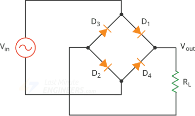

This circuit’s operation is easily understood one half-cycle at a time.

During the positive half cycle of the source, diodes D1 and D2 conduct while D3 and D4 are reverse biased. This produces a positive load voltage across the load resistor (note the plus-minus polarity across the load resistor).

During the next half-cycle, the source voltage polarity reverses. Now, D3 and D4 are forward biased while D1 and D2 are reverse biased. This also produces a positive load voltage across the load resistor as before.

Note that regardless of the polarity of the input, the load voltage has the same polarity and the load current is in the same direction.

In this way the circuit converts the AC input voltage to the pulsating DC output voltage.

If it is frustrating for you to remember the proper layout of the diode in a bridge rectifier circuit, you can refer to an alternative representation of the circuit. This is exactly the same circuit except all diodes are horizontal and point in the same direction.

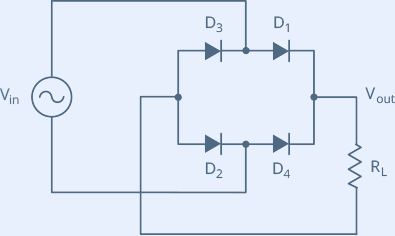
## DC Value of a Full-Wave Signal
Because a bridge rectifier produces a full-wave output, the formula for calculating average DC value is the same as that given for the full-wave rectifier:

This equation tells us that the DC value of a full-wave signal is about 63.6 percent of the peak value. For example, if the peak voltage of the full-wave signal is 10V, the dc voltage will be 6.36V

When you measure the half-wave signal with a DC voltmeter, the reading will equal the average DC value.
## A Second-order Approximation
In reality, we do not get a perfect full-wave voltage across the load resistor. Because of the barrier potential, the diode does not turn on until the source voltage reaches about 0.7V.

And as the bridge rectifier operates two diodes at a time, two diode drops (0.7 \* 2 = 1.4V) of the source voltage is lost in the diode. So the peak output voltage is given by:

## Output Frequency
The full-wave rectifier inverts each negative half cycle, doubling the number of positive half cycles. Because of this, full-wave output has twice as many cycles as the input.

Therefore the frequency of the full-wave signal is double the input frequency.

For example, if the line frequency is 60Hz, the output frequency will be 120Hz.
## Filtering the Output of a Rectifier
The output we get from a full-wave rectifier is a pulsating DC voltage that increases to a maximum and then decreases to zero.

We do not need this kind of DC voltage. What we need is a steady and constant DC voltage, free of any voltage variation or ripple, as we get from the battery.

To obtain such a voltage, we need to filter the full-wave signal. One way to do this is to connect a capacitor, known as a smoothing capacitor, across the load resistor as shown below.

Initially, the capacitor is uncharged. During the first quarter-cycle, diodes D1 and D2 are forward biased, so the capacitor starts charging. The charging continues until the input reaches its peak value. At this point, the capacitor voltage equals Vp.

After the input voltage reaches its peak, it begins to decrease. As soon as the input voltage is less than Vp, the voltage across the capacitor exceeds the input voltage which turns off the diodes.

As the diodes are off, the capacitor discharges through the load resistor and supplies the load current, until the next peak is arrived.

When the next peak arrives, diodes D3 and D4 conduct briefly and recharge the capacitor to the peak value.

## Disadvantage
The only disadvantage of the bridge rectifier is that the output voltage is two diode drops (1.4V) less than the input voltage.

This disadvantage is only a problem in very low voltage power supplies. For instance, if the peak source voltage is only 5V, the load voltage will have a peak of only 3.6V. But if the peak source voltage is 100 V, the load voltage will be close to a perfect full-wave voltage (the diode drops are negligible).
# The Zener Diode
Ordinary silicon diodes block any current through them when they are reverse biased, and are damaged when the reverse voltage is too high. Therefore, these diodes are never intentionally operated in the breakdown region.

Zener diodes, however, are different. They are specially designed to operate in the breakdown region without failure. For this reason, Zener diodes are sometimes referred to as breakdown diodes.

Zener diodes are the backbone of voltage regulators, and circuits that keep the load voltage almost constant despite large changes in line voltage and load resistance.

The following figures show the schematic symbols of a zener diode. In either symbol, the lines resemble a “Z“, which stands for “Zener“.

## Zener Diode Working
A zener diode can operate in any of three regions: forward, leakage, and breakdown. Let’s understand this through the I-V graph of a zener diode.

### Forward Bias Region
When forward-biased, Zener diodes behave much the same as ordinary silicon diodes and start conducting at around 0.7V

### Leakage Region
The leakage region exists between zero current and breakdown.

In the leakage region, a small reverse current flows through the diode. This reverse current is caused by the thermally produced minority carriers.

### Breakdown Region
If you continue increasing the reverse voltage, you will eventually reach the so-called Zener voltage VZ of the diode.

At this point, a process called Avalanche Breakdown occurs in the semiconductor depletion layer and the diode starts conducting heavily in the reverse direction.

You can see from the graph that the breakdown has a very sharp knee, followed by an almost vertical increase in current. Note that the voltage across the zener diode is almost constant and approximately equal to VZ over most of the breakdown region.

The graph also shows the maximum reverse current IZ(Max). As long as the reverse current is less than IZ(Max), the diode operates within its safe range. If the current exceeds IZ(Max), the diode will be destroyed.
## Zener Voltage Regulator
The Zener diode maintains a constant output voltage in the breakdown region, even though the current through it varies. This is an important feature of the zener diode, which can be used in voltage regulator applications. Therefore a zener diode is sometimes called a Voltage-regulator diode.

For example, the output of half-wave, full-wave or bridge rectifiers consists of ripples superimposed on a DC voltage. By connecting a simple zener diode across the output of the rectifier, we can obtain a more stable DC output voltage.

The following figure shows a simple zener voltage regulator (also known as a zener regulator).

To operate the zener diode in its breakdown condition, the zener diode is reverse biased by connecting its cathode to the positive terminal of the input supply.

A series (current-limiting) resistor RS is connected in series with the zener diode so that the current flowing through the diode is less than its maximum current rating. Otherwise, the zener diode will burn out, like any device because of too much power dissipation.

The voltage source VS is connected across the combination. Also, to keep the diode in its breakdown condition, the source voltage VS must be greater than the zener breakdown voltage VZ.

The stabilized output voltage Vout is taken from across the zener diode.
### Breakdown Operation
To test whether the zener diode is operating in the breakdown region, we need to calculate how much Thevenin voltage the diode is facing.

Thevenin voltage is the voltage that exists when the zener diode is disconnected from the circuit.

Because of the voltage divider, we can write:

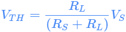

When this voltage exceeds the zener voltage, breakdown occurs.
### Series Current

The voltage across the series resistor equals the difference between the source voltage and the zener voltage. Therefore, according to the Ohm’s law, the current through the series resistor is:

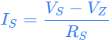

The series current remains the same whether or not there is a load resistor. Meaning, even if you disconnect the load resistor, the current through the series resistor will be equal to the voltage across the resistor divided by the resistance.
### Load Voltage and Load Current

Because the load resistor is in parallel with the zener diode, the load voltage is the same as the Zener voltage.

Using the Ohm’s law, we can calculate the load current:

### Zener Current

The zener diode and the load resistor are in parallel. The total current is equal to the sum of their currents, which is the same as the current through the series resistor.

This tells us that, the zener current equals the series current minus the load current.

## Common Zener Diode Voltages
Zener diodes are manufactured in standard voltage ratings listed in Table below. The table lists common voltages for 0.3W and 1.3W parts.

|Common voltages for 0.3W|
| :-: |
|2.7V|3.0V|3.3V|3.6V|3.9V|4.3V|4.7V|
|5.1V|5.6V|6.2V|6.8V|7.5V|8.2V|9.1V|
|10V|11V|12V|13V|15V|16V|18V|
|20V|24V|27V|30V||||

|Common voltages for 1.3W|
| :-: |
|4.7V|5.1V|5.6V|6.2V|6.8V|7.5V|8.2V|
|9.1V|10V|11V|12V|13V|15V|16V|
|18V|20V|22V|24V|27V|30V|33V|
|36V|39V|43V|47V|51V|56V|62V|
|68V|75V|100V|200V||||
The wattage corresponds to the power that the diode can dissipate without damage.
## Zener Applications
So far we have seen how Zener diodes can be used to regulate a continuous DC source. Apart from that, Zener diodes are also used in different applications. Here are some of them.
### Preregulator
The basic idea behind Preregulator is to provide a well-regulated input to the zener regulator so that the final output is extremely well regulated.

Below is an example of a preregulator (the first zener diode) driving a zener regulator (the second zener diode).

### Waveshaping
In most applications, zener diodes remain in the breakdown region. But there are exceptions such as waveshaping circuits.

In above waveshaping circuit, two zener diodes are connected back-to-back to generate a square wave. This circuit is also jokingly called “The poor man’s square wave generator“.

On the positive half-cycle, the upper diode Z1 conducts and the lower diode Z2 breaks down. Therefore, the output is clipped.

On the negative half-cycle, the action is reversed. The lower diode Z2 conducts, and the upper diode Z1 breaks down. In this way the output is approximately a square wave.

The clipping level equals the zener voltage (broken-down diode) plus 0.7V (forward-biased diode).
### Producing Non Standard Output Voltages
By combining zener diodes with ordinary silicon diodes, we can produce several nonstandard DC output voltages like this:

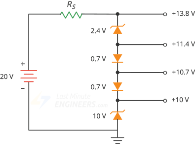
### Driving a Relay
As you may know that connecting a 6V relay to a 12V system can cause damage to the relay. You need to drop some of the voltage. Below figure shows one way to accomplish this.

In this circuit, 5.6V zener diode is connected in series with the relay so that only 6.4V appears across the relay, which is within the tolerance of the relay’s voltage rating.
# Light Emitting Diode (LED)
LEDs are everywhere – in our phones, in our cars, and even in our homes. Whenever an electronic device lights up, there is a good chance that an LED is behind it.

LEDs are like tiny light bulbs. Low energy consumption, small size, rapid switching and long lifespan makes them ideal for mobile devices and other low-power applications.

LED stands for Light Emitting Diode. They are a special type of diode that convert electrical energy into light. They have very similar electrical characteristics to a normal PN Junction Diode. That’s why the symbol of LED is similar to the normal PN junction diode except that it contains arrows pointing away from the diode indicating that light is being emitted by the diode.

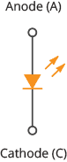
## LED Construction
LEDs are so common, they come in a huge variety of shapes, sizes and colors. The LEDs you are most likely to use are the standard through hole LEDs with two legs. Following figure shows the parts of it.

The construction of an LED is very different from an ordinary diode. The PN junction of an LED is surrounded by a transparent, rigid plastic epoxy resin shell.

The shell is constructed in such a way that photons of light emitted by the junction are focused upward through the domed top of the LED, which itself acts like a lens. This is why the emitted light appears brightest on top of the LED.

Just as in an ordinary diode, the positive side of the LED is called the Anode, while the negative side of the LED is called the Cathode. The cathode is usually indicated by having a shorter lead than the anode. Not only this, the outside of the plastic case typically has a flat spot or notch which can also indicate the cathode side of the LED.

Not all LEDs are hemispherical in shape, some are rectangular while some are cylindrical, but they are mostly constructed in the same way.

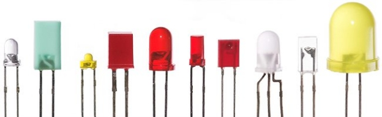*Image courtesy: wikipedia.org*
## LED Working
Like an ordinary diode, the LED operates only in forward bias condition. When the LED is forward biased, the free electrons cross the PN junction and recombine with holes. Since these electrons fall from a higher to a lower energy level, they radiate energy in the form of photons (light).

In ordinary diodes, this energy is radiated as heat while in an LED, energy is radiated as light. This effect is called Electroluminescence.

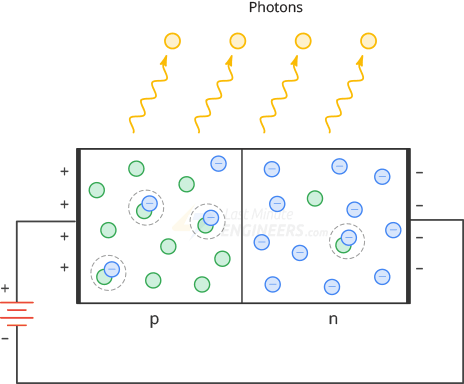
## LED Colors
Light emitting diodes are available in a wide range of colors with the most common being red, green, yellow, blue, orange, white and infrared (invisible) light.

Unlike ordinary diodes that are made of germanium or silicon, LEDs are made of elements such as gallium, arsenic, and phosphorus. By mixing these elements together in different proportions, a manufacturer can produce LEDs that radiate different colors as shown in the table below.

|Color|
`  `Wavelength  

(nm)
|
Forward Voltage

(V)
|Material|
| :-: | :-: | :-: | :-: |
|Ultraviolet|<400|3.1-4.4|
Aluminum nitride(ALN)

Aluminum gallium nitride (AIGaN)
|
|Violet|400-450|2.8-4.0|Indium gallium nitride (InGaN)|
|Blue|450-500|2.5-3.7|
Indium gallium nitride (InGaN)

Silicon carbide (SiC)
|
|Green|500-570|1.9-4.0|
Gallium phosphide (GaP)

Aluminum gallium phosphide (ALGaP)
|
|Yellow|570-590|2.1-2.2|
Gallium arsenide phosphide (GaAsP)

gallium phosphide (GaP)
|
|Orange|590-610|2.0-2.1|
Gallium arsenide phosphide(GaAsP)

gallium phosphide (GaP)
|
|Red|610-760|1.6-2.0|
Aluminum gallium arsenide (AIGaAs)

Gallium arsenide phosphide (GaAP)

Gallium phosphide (GaP)
|
|Infrared|>760|>1.9|
Gallium arsenide(GaAs)

Aluminum gallium arsenide (ALGaAs)
|
The actual color of an LED is determined by the wavelength of light emitted, which in turn is determined by the actual semiconductor material used to make the diode.

Therefore the color of the light emitted by an LED is NOT determined by the color of the body of the LED. It just enhances the light output and indicates its color when it is not illuminated.
## LED Voltage and Current
For most low-power LEDs, the typical voltage drop is from 1.2V to 3.6V for currents between 10mA to 30mA. The exact voltage drop will of course depend upon the semiconductor material used, color, tolerance, along with other factors.

As the LED is basically a diode, its IV characteristics curves can be plotted for each color as shown below.

Unless otherwise specified, you should consider a nominal drop of 2V and forward current 20mA.
## LED Brightness
The brightness of an LED depends directly on how much current it draws. The more current it draws, the brighter the LED will be.

You can control the brightness of an LED by controlling the amount of current through it.
## The Current Limiting resistor
If you connect an LED directly to a battery or power supply it will try to dissipate as much power as possible, and it will destroy itself almost instantly.

Therefore it is important to limit the amount of current flowing through the LED. For this, we use resistors. The resistor limits the flow of electrons in the circuit and prevents the LED from trying to draw too much current.

The current-limiting resistor is placed between LED and voltage source in this way:

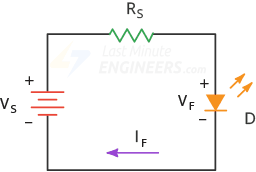

In above circuit, the resistor has a node voltage of VS on the left and a node voltage of VF on the right, the voltage across the resistor is the difference between the two voltages.

By applying Ohm’s law, the current-limiting resistor is calculated as:

## Basic Example
Consider a red LED with a forward voltage drop of 1.8V connected to a 5V DC power supply. Calculate the value of the current-limiting resistor required to limit the forward current to approximately 10mA.

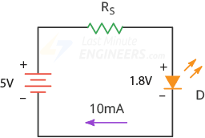
### Solution:
Using the formula above, the current-limiting resistor is:

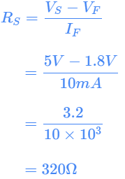

This suggests that we will need a 320Ω resistor to limit the current to 10mA. But 320Ω is not a standard preferred value, so we will need to choose the next highest value, which is 330Ω.

Let’s recalculate the forward current for the 330Ω current-limiting resistor:

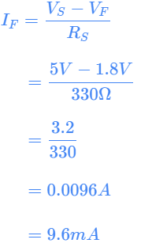

We got a new forward current value of 9.6mA which is fine.
## Multi-color LEDs
Most LEDs produce only one output of colored light. However, multi-color LEDs are now available that can produce a range of different colors from within a single device. These actually have several LEDs fabricated in a single package.
### RGB LEDs
At first glance, RGB (Red, Green, Blue) LEDs look just like regular LEDs, however, inside the usual LED package, there are actually three LEDs, one red, one green and yes, one blue. By controlling the intensity of each of the individual LEDs you can mix pretty much any color you want.

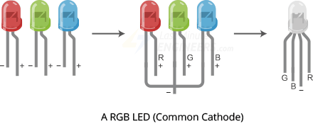

The RGB LED has four pins: one for each color, and a common pin. On some, the common pin is the anode, and on others, it’s the cathode.
### Bi-Color LEDs
Unlike RGB LED, Bi-color LED lacks blue LED inside the LED package. Typically, there are only two LEDs, one red and one green. By controlling the intensity of each of the individual LEDs you can mix only shades of Red and Green only.

The Bi-color LED has three pins: one for each color, and a common pin. Similar to RGB LEDs, On some, the common pin is the anode, and on others, it’s the cathode.

